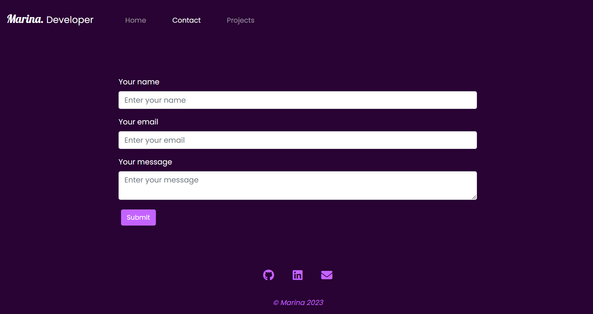

# React Portfolio

## Description

A responsive portfolio build as a Single Page Application using React and Boostrap CSS. It showcaseS my most recent projects to peers and potential employers.

## Table of Contents

- [Installation](#installation)
- [Usage](#usage)
- [Credits](#credits)
- [License](#license)

## Installation

N/A

## Usage

The live application is available [here](https://marinaongithub.github.io/react-portfolio).

Click on Home, Contact or Projects to navigate to the corresponding sections.

The Contact section displays a form (not set up). Click on the icons at the bottom of the page depending on how you want to connect with me.

The Project Gallery features 6 projects displayed as cards. Each card shows a screenshot of the project, a description and links to the live project as well as the source code on Github.  

## Credits

Used to fix the 404 issue on page reload when the application is deployed to GitHub Pages:
https://github.com/rafgraph/spa-github-pages

## License

MIT License

